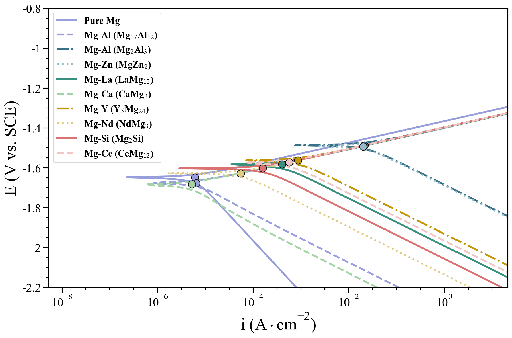
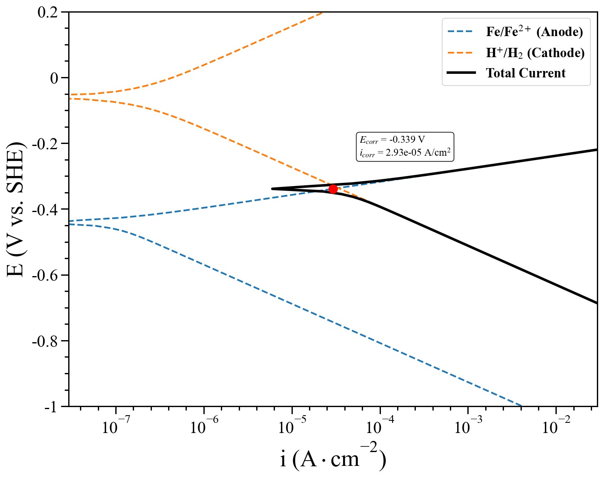
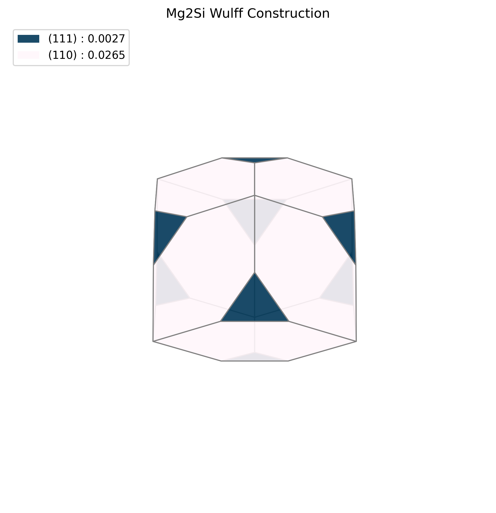
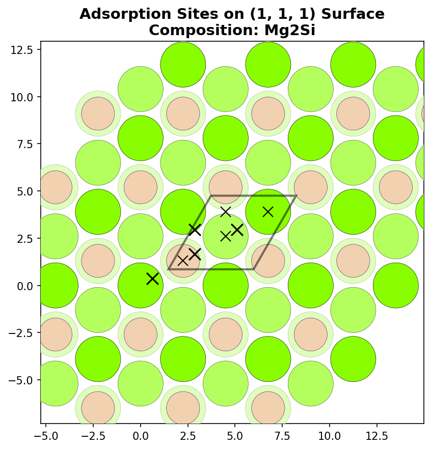
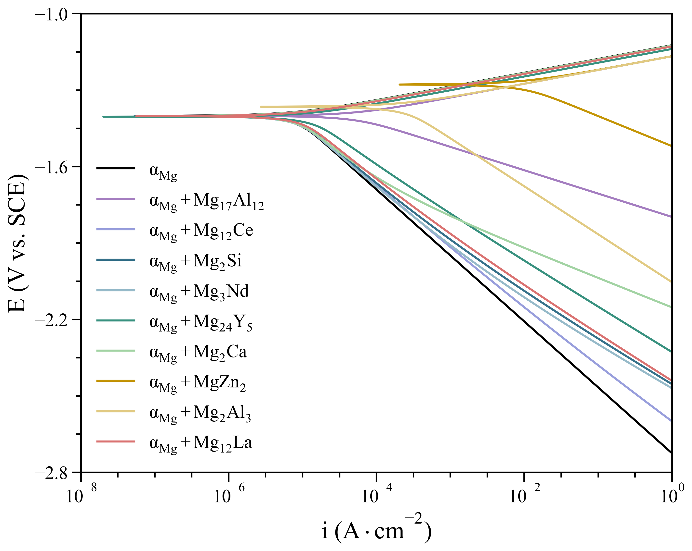
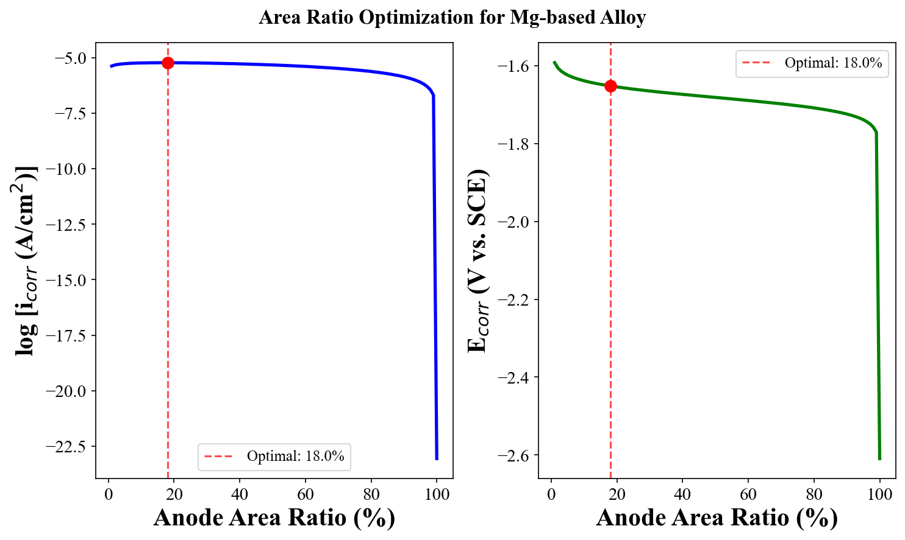
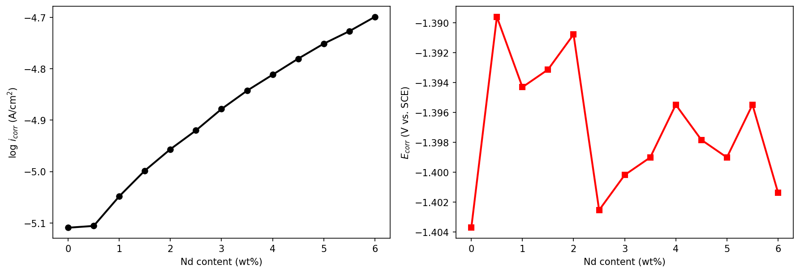
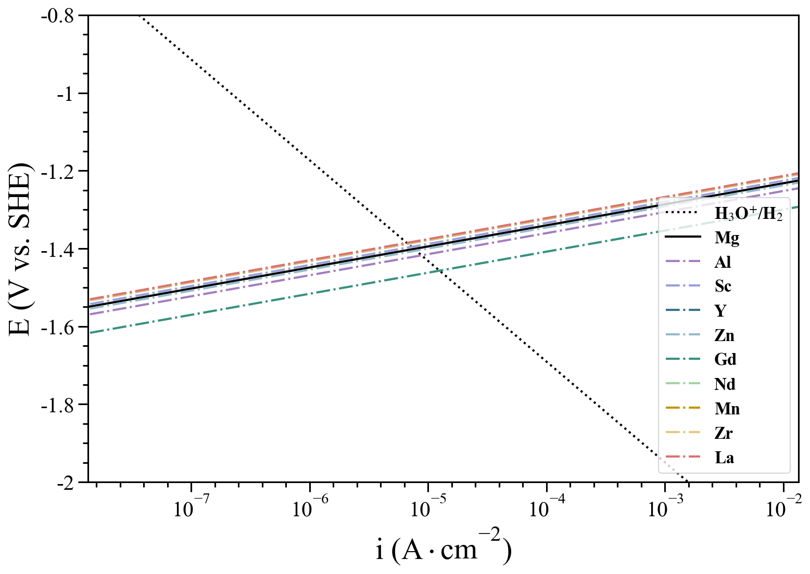

<p align="center">
  
</p>

<h1 align="center">GalvCalc</h1>

<p align="center">
  <em>From atomic-scale descriptors to macroscopic corrosion polarization curves</em>
</p>

<p align="center">
  <a href="https://pypi.org/project/GalvCalc/"></a>
  <a href="https://pypi.org/project/GalvCalc/"></a>
  <a href="LICENSE"></a>
</p>

**GalvCalc** is a computational framework for modeling the micro-galvanic
corrosion of alloys with coupled anodic dissolution and hydrogen evolution
kinetics. It bridges atomic-scale material descriptors with macroscopic
corrosion behavior: starting from a bulk crystal structure, it automates the
generation of surface models, estimates electrochemical descriptors
(equilibrium potentials, work functions, surface energies and hydrogen
adsorption energies), and assembles multi-phase polarization curves — with
built-in anode/cathode area-ratio optimization and alloy-content scans of the
corrosion current and potential.

The package is developed alongside the manuscript
*"GalvCalc: A Framework for Modeling Micro-galvanic Corrosion of Alloys with
Coupled Anodic Dissolution and Hydrogen Evolution Kinetics"*.

---

## Features

| Module | Purpose |
| --- | --- |
| `GalvCalc.core` | `Bulk` / `Surface` structure classes, equilibrium-potential engine (`ion_energy.yaml` database), Wulff-aware plotting helpers |
| `GalvCalc.cathode` | surface-property manager (surface energies, work functions, Wulff shapes), hydrogen-adsorption manager, facet-weighted exchange-current (`i_c0`) estimation |
| `GalvCalc.anode` | substitutional surface doping of anode materials and electrochemical descriptor tables |
| `GalvCalc.polarization` | Butler–Volmer polarization curves (Mg & Fe parameterizations), multi-anode/multi-cathode plots, anode/cathode area-ratio optimization, alloy-content scans |
| `GalvCalc.predictor` | ML predictors: CGCNN for surface energies / work functions and a TabPFN model for hydrogen adsorption energies |

Highlights:

- Nernst-based equilibrium potentials for arbitrary ion combinations (Mg, Fe,
  Zn, Al, Sc, ...) with a built-in thermodynamic ion-energy database.
- Automatic slab generation from bulk POSCAR/CIF inputs with full pymatgen
  interoperability (`Structure`, `Slab`, `WulffShape`, `SlabEntry`).
- Calibrated Butler-Volmer kinetics: the Mg parameterization (anodic n = 2,
  `alpha_a * n` exponent, no prefactor) and the Fe parameterization (n = 1,
  `(alpha_a + 1) * n` exponent, prefactor of 2).
- DFT-grounded second-phase exchange currents for Mg alloys (Mg17Al12,
  Mg2Al3, MgZn2, LaMg12, CaMg2, Y5Mg24, NdMg3, Mg2Si, CeMg12).
- Pre-trained ML models included: CGCNN (`model_best.pth.tar`) for surface
  energies & work functions and a TabPFN ensemble (`saved_model.pkl`) for
  H-adsorption energies — no re-training required.
- One-call manuscript-style figures:
  `plot_mg_second_phases()` reproduces the paper's multi-second-phase
  polarization curves (9 Mg intermetallics) with the calibrated Mg
  kinetics, while `mg_second_phase_example()` returns the matching
  `Composition` list.
- Publication-quality figures: polarization curves, Wulff shapes, adsorption
  site schematics, area-ratio optimization and alloy-content scans. All
  figures use `10^n`-style current tick labels (no log-text axis label) and
  `\mathregular{}`-typeset sub/superscripts, with the zero-potential tick
  cleaned from the y axis.

---

## Gallery

Figures below are generated by the bundled demo notebook
`GalvCalc/examples/galvcalc_demo.ipynb`.

| | |
| --- | --- |
|  |  |
|  |  |
|  |  |
|  |  |

---

## Installation

```bash
pip install GalvCalc
```

By default the lightweight core dependencies are installed. Three optional
extras are available:

```bash
pip install "GalvCalc[defects]"   # full pymatgen defect-based anode doping
pip install "GalvCalc[ml]"        # ML predictors (CGCNN / TabPFN)
pip install "GalvCalc[examples]"  # run the bundled Jupyter notebooks
```

The `defects` extra requires Python >= 3.10 and installs a recent pymatgen
(>= 2024.10) together with the `pymatgen-analysis-defects` extension package.
It enables the full `Substitution`-based doping workflow in
`GalvCalc.anode` (see Section 5).

For the bundled Jupyter examples:

```bash
pip install "GalvCalc[examples]"
```

### Requirements

- Python >= 3.9
- `numpy`, `scipy`, `pandas`, `matplotlib`, `pymatgen`, `PyYAML`, `sympy`,
  `tqdm`, `joblib`, `openpyxl`
- ML extras: `torch`, `scikit-learn`, `tabpfn`

---

## Quick start

### 1. Equilibrium potentials from a bulk structure

```python
from GalvCalc.core.structures import Bulk

bulk = Bulk.from_file("POSCAR")                       # any pymatgen-readable file
print(bulk.basic_properties())

Ee = Bulk.get_equilibrium_potential(
    ions="Mg[2+]",
    ion_numbers=[1],
    energy_formation=0.0,
)
print(f"E_eq = {Ee:.3f} V vs. SHE")

# multi-ion / compound dissolution, e.g. Mg2Ge
Ee2 = Bulk.get_equilibrium_potential(
    ions="Mg[2+], Ge[2+]",
    ion_numbers=[2, 1],
    energy_formation=-0.24,
)
```

### 2. Surface generation and properties

```python
from GalvCalc.core.structures import Bulk
from GalvCalc.cathode.surfaces import SurfaceProperties

bulk = Bulk.from_file("Mg2Si.poscar")
surfaces = SurfaceProperties.from_bulk_structure(bulk, max_index=1, min_slab_size=10)

df = surfaces.get_properties_dataframe(
    slab_energies={"Mg2Si_111_1": -0.62135394, "Mg2Si_110_1": -0.21012105},
    bulk_energy=-0.36261690,
    work_functions={"Mg2Si_111_1": 14.0, "Mg2Si_110_1": 22.0},
)
print(df)

wulff = surfaces.wulff_construct(surfaces.surface_energies_dict)
```

### 3. Hydrogen adsorption analysis

```python
from GalvCalc.cathode.hydrogen import AdsorptionManager

manager = AdsorptionManager(surfaces.surfaces)
results = manager.H_adsorption_analysis(adsorbate="H", output_dir="H_adsorption")
df_sites = manager.get_site_properties_dataframe()
```

### 4. Polarization curves and area-ratio optimization

Two calibrated Butler-Volmer parameterizations are supported. Fe systems use
the `"fe"` form (n = 1, exponent `(alpha_a + 1) * n`, prefactor 2):

```python
from GalvCalc.polarization import (
    ElectrodeParameters, Composition, plot_single_polarization,
)
from GalvCalc.polarization.area_ratio import (
    AreaRatioParameters, AreaRatioAnalyzer, create_example_parameters,
)

anode = ElectrodeParameters(4.1e-8, -0.44, 0.5, name="Fe/Fe2+", kinetic_form="fe")
cathode = ElectrodeParameters(7.9e-8, -0.059, 0.5, name="H+/H2", kinetic_form="fe")
comp = Composition("Fe", anode=anode, cathodes=[cathode], area_ratios=[1, 1])
fig = plot_single_polarization(comp, reference_electrode="SHE")

params = create_example_parameters()
fig2, optimal_ratio, i_max = AreaRatioAnalyzer().plot_area_ratio_analysis(params)
print(f"optimal anode area ratio = {optimal_ratio:.2%}")
```

Mg systems use the manuscript form `"mg"` (anodic n = 2, exponent
`alpha_a * n`, no prefactor) with the calibrated pure-Mg anode
(i0 = 1e-22.2 A/cm^2, alpha_a = 0.55) and HER cathode (i0 = 1e-8.1 A/cm^2,
alpha_c = 0.77):

```python
from GalvCalc.polarization import create_mg_based_compositions, plot_comparison_polarization

comps = create_mg_based_compositions()   # Pure Mg + 9 Mg-alloy second phases
fig = plot_comparison_polarization(comps, reference_electrode="SCE")
```

The DFT-derived second-phase cathodic exchange currents used by
`create_mg_based_compositions` are hard-coded from the manuscript dataset
(Mg17Al12, Mg2Al3, MgZn2, LaMg12, CaMg2, Y5Mg24, NdMg3, Mg2Si, CeMg12) —
replace them with your own values when studying a different system.

### 5. Substitutional doping of anode materials

Doping is performed on pymatgen's defect-analysis framework: the substitution
itself is carried out with `pymatgen.analysis.defects.core.Substitution`, while
`pymatgen.symmetry.analyzer.SpacegroupAnalyzer` is used to select a
symmetry-equivalent host site and to report its multiplicity. By default the
dopant is placed in the *second* layer below the surface (`layer=2`), which
keeps the outermost surface plane intact; use `layer=1` for the outermost
layer or a negative value (e.g. `layer=-2`) to count from the bottom surface.

```python
from GalvCalc.core.structures import Bulk, Surface
from GalvCalc.anode import SurfaceDopingManager

bulk = Bulk.from_file("Mg.poscar")
surface = Surface.from_bulk(bulk, miller_index=(0, 0, 1))
manager = SurfaceDopingManager(surface, "Mg_001")

# Second-layer doping with Zn, Al and Y (default layer=2)
manager.batch_dope(["Zn", "Al", "Y"])

# DFT-derived descriptors for the pure and doped surfaces
manager.set_property("Mg_001", "work_function", 3.72)
manager.set_property("Mg_001", "vacancy_energy", 0.84)
manager.set_property("Mg_001_Zn", "work_function", 3.75)
manager.set_property("Mg_001_Zn", "vacancy_energy", 0.79)

df = manager.calculate_electrochemical_properties(E00=-2.37, ia00=1e-5)
print(df[["surface_name", "E0_calculated", "ia0_calculated", "dopant_element"]])
```

Each doped structure is exported as a POSCAR file into `doped_surfaces/`, and
the full doping record (host/dopant elements, site index, coordinates, layer,
symmetry multiplicity) is available from `manager.doping_info`.

### 6. ML prediction interfaces

```python
from GalvCalc.predictor import predict_cgcnn, predict

# CGCNN: surface energy + work function from a folder of CIF files
res = predict_cgcnn(cifpath="surfaces_output", task="regression")

# TabPFN: H adsorption energy (eV) for pymatgen structures
from pymatgen.core import Structure
energies = predict([Structure.from_file("H1.vasp")])
```

### 7. Alloy-content scans

`scan_corrosion_vs_content` evaluates how the corrosion current and potential
change with the weight percent of an alloying element. The volume fraction of
the intermetallic second phase is derived from the solute content
(`wt_to_vol_fraction`), and the Butler-Volmer kinetics are re-fitted at every
content level:

```python
import numpy as np
from GalvCalc.polarization import (
    mg3nd_vol_fraction, mg3nd_kinetics, scan_corrosion_vs_content,
)

nd_wt = np.linspace(0, 6, 25)                       # Nd content (wt%)
df_scan = scan_corrosion_vs_content(
    nd_wt,
    params_fn=lambda w: mg3nd_kinetics(w, mg3nd_vol_fraction(w)),
    domain=(0.0, 1.0),
    n_ratios=51,
    n_potentials=1500,
)
df_scan[["content", "max_log10_i_corr", "E_corr_at_max"]].round(4)
```

---

## Example notebooks

The repository ships runnable notebooks under `GalvCalc/examples/`:

- `examples/galvcalc_demo.ipynb` — end-to-end walkthrough of all modules
  (recommended starting point): equilibrium potentials, slab generation,
  adsorption-site schematics, Wulff construction, facet-weighted i_c0 from the
  DFT Mg2Si dataset, anode doping, polarization curves (Mg & Fe), area-ratio
  optimization and alloy-content scans;

Example structures (`POSCAR`, `*.poscar`, `*.vasp`, `surface/*.vasp`) and the
adsorption-analysis CSV (Mg2Si DFT dataset) are provided in the same folder.

---

## Command line

A small console script is provided:

```bash
galvcalc --version     # GalvCalc 1.0.0
galvcalc --modules     # list available submodules
```

---

## Citation

If you use GalvCalc in your research, please cite:

> Shi, G. *et al.* GalvCalc: A Framework for Modeling Micro-galvanic Corrosion
> of Alloys with Coupled Anodic Dissolution and Hydrogen Evolution Kinetics.
> (manuscript)

---

## License

Distributed under the [MIT License](LICENSE).

## Contact

Gaoning Shi — gaoning_shi@sjtu.edu.cn
